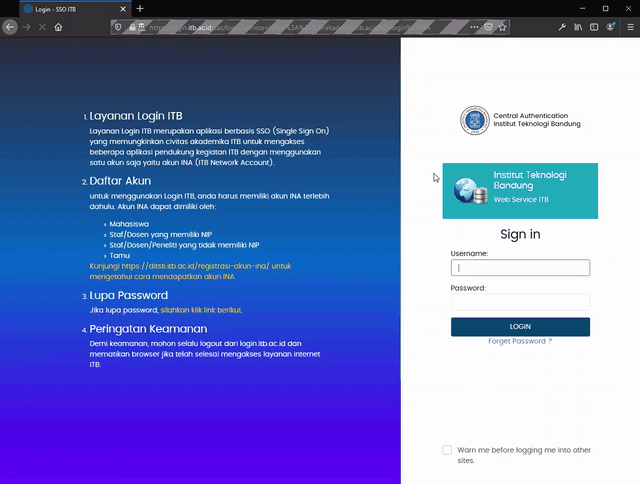

# SIX Automated Presence

> Buat kelas onlen.

# Pendahuluan



Buat absen di SIX ITB. CRON not included, silakan fork untuk kepentingan bersama.

# Prerequisites

- Punya Python. Kalo gapunya ya gabisa.
- Untuk Selenium harus disetup sendiri; cari driver browser yang sesuai. Dalam code ini saya menggunakan [geckodriver](https://github.com/mozilla/geckodriver/releases) untuk Firefox. Ikutin petunjuk yang ada, masukin ke _*PATH*_.

_Note_: As per 23/09/2020, setup Selenium sudah bisa diabaikan bila menggunakan modul absensi berbasiskan HTTP Request. (`presence_by_request.py`)

# Setup

1. Jalanin di cmd/terminal untuk setup venv:

```bash
python -m venv venv
```

2. Masuk ke venv:

Untuk Windows:

```bash
venv\Scripts\activate
pip install -r requirements.txt
```

Untuk Linux-based System:

```
./venv/scripts/activate
pip install -r requirements.txt
```

3. Buat file `credentials.json`, masukkan username dan password akun SIX Anda (lihat contoh pada credentials.example.json).

4. Jalankan code ini.

```bash
run.bat
```

# CRON


## Windows:

1. Tambahkan folder root SIX-Automated-Presence ke PATH (Environment Variable)

2. Jalankan cron.bat untuk aktivasi/deaktivasi CRON

Catatan: 
Auto scheduler ini dibuat untuk run program setiap 60 menit sejak tasks scheduler dibuat, Anda dapat menyesuaikannya sendiri dengan mengubah cron.bat, silakan link referensi
Sebaiknya buat tasks scheduler ketika baru saja mengabsen, misal Anda meengabsen pada 7.01 dan membuat tasks schedule pada 7.02 maka Program akan di run pada 8.02, 9.02, dst sehingga Anda tidak kelewatan Presensi.
Hati-hati bila jadwal kuliah Anda Ada yang tidak memiliki pola yang tetap.

Referensi: [Membuat task scheduler pada Windwos](https://docs.microsoft.com/en-us/windows-server/administration/windows-commands/schtasks)


# Contributing

Jika hendak contribute, silahkan submit Pull Request, nanti akan direview. (Mungkin) akan butuh beberapa hal seperti:

- CRON support (script jalan di background tiap suatu interval)
- Multithread support (melakukan absensi beberapa orang sekaligus)

# Issue
Anda juga dapat membuat kontribusi untuk project ini dengan melaporkan issue
Jangan percaya program ini 100%, tetap lakukan pengecekan kembali
